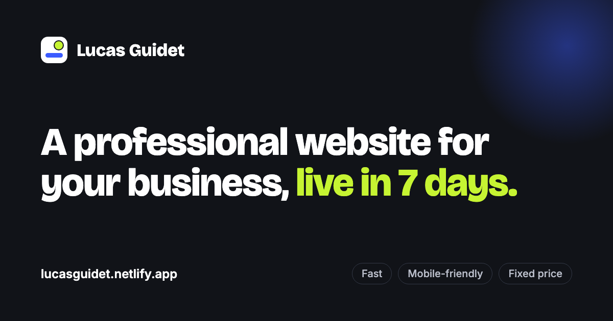

# Lucas Guidet — Web Design Portfolio

Portfolio site and three demo websites for small businesses: a French bistro, a physiotherapy clinic and a bespoke furniture workshop.

**Live site:** https://lucasguidet.netlify.app



## Demos

The three businesses are fictional. Each site has its own visual identity and was built from scratch, without a template.

| Demo | Sector | Notable features |
|---|---|---|
| [Chez Marcel](https://lucasguidet.netlify.app/demo-restaurant/) | Restaurant | Keyboard-accessible menu tabs, table booking form with opening-day rules, click-to-call button on mobile |
| [Balance Physio](https://lucasguidet.netlify.app/demo-clinic/) | Healthcare | Appointment time-slot picker, pricing and insurance section, FAQ |
| [Atelier Lumière](https://lucasguidet.netlify.app/demo-craftsman/) | Craft / furniture | Filterable project gallery with animated layout, lightbox, quote request form |

## Stack

- HTML, CSS and vanilla JavaScript, no framework and no build step
- Mobile-first responsive layouts, tested from 360 px to 1440 px
- Semantic markup, keyboard navigation, visible focus states and `prefers-reduced-motion` support
- Open Graph and basic SEO metadata on every page
- Contact form handled by [Formspree](https://formspree.io); the demo forms are front-end only
- Hosted on Netlify, deployed automatically from `main`

## Structure

```
.
├── index.html, style.css, script.js   Portfolio page
├── og-image.png                       Social preview image
├── demo-restaurant/                   Chez Marcel
├── demo-clinic/                       Balance Physio
└── demo-craftsman/                    Atelier Lumière
```

Each site is self-contained (`index.html`, `style.css`, `script.js`). Colours and fonts are defined as CSS custom properties at the top of each stylesheet.

## Running locally

```bash
python3 -m http.server 8000
```

Then open http://localhost:8000. The contact form needs to be served over HTTP; it will not submit when `index.html` is opened directly from the file system.

## Contact

Lucas Guidet — lucasguidetpro@gmail.com

## License

© Lucas Guidet. All rights reserved. The code is published for viewing only; please do not reuse the designs or content without permission.
